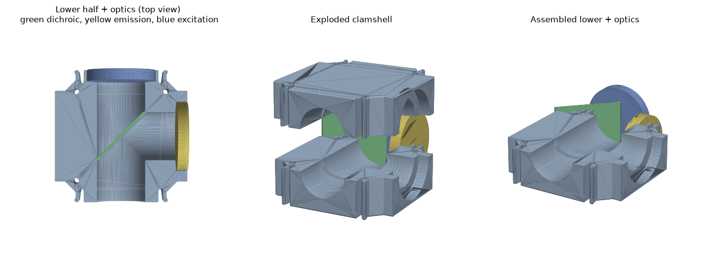

# openUC2 V4 beamsplitter / fluorescence-filter insert

*Parametric generator for the kinematic beamsplitter cube — the printable
clamshell that carries an excitation filter, an emission filter and a 45°
dichroic through one 50 mm cell. Modelled on the released reference pair
`PRT - 2074 / PRT - 2075` (`MAS - 2063 - Insert splitter plus 2 filters as
discs`), probed from Inventor over COM (see [`extracted/`](extracted/)).*

Source: [`uc2v4/beamsplitter_insert.py`](uc2v4/beamsplitter_insert.py).
Verified by [`check_inserts.py`](check_inserts.py).



## 1. What it is

A fluorescence filter cube routes three beams through one cell:

```
   excitation  >───┐
                   │  dichroic, 45°
       sample  ↕───┼───↕  emission >
                   │
```

The **excitation** light comes in a side face, reflects off the 45° **dichroic**
down to the **sample** (objective), and the returning fluorescence passes
*through* the dichroic and out to the **emission** filter (camera).

Because a Ø25 dichroic turned 45° is ~18 mm deep and each filter wants its own
seat, the whole thing is a tall square insert that fills the cell and **splits
at its mid-plane** into a **lower** and an **upper** printed half. You open it
like a book, drop the three optics into their seats, close it and pin it — every
seat straddles the split plane, so that plane is what gives you access. This is
exactly the reference design; only the numbers are now parametric.

## 2. Coordinate frame and ports

| axis | role |
| --- | --- |
| **+X** | excitation port (from the light source) |
| **+Y** | emission port (to the camera) |
| **−Y** | sample port (objective) — a plain open bore |
| **+Z** | the stack / split / pin axis (how the clamshell opens) |

With the default 45° dichroic the excitation (+X in) reflects to the sample
(−Y). `handedness = -1` mirrors that (excitation → +Y). Any `fold_deg` in
`[0, 90)` is allowed; `0` stands the dichroic square across the beam (a plain
plate beamsplitter).

## 3. Parameters

Each optic is a `Plate` (shared with [`fold_insert.py`](uc2v4/fold_insert.py)):
**round** (`diameter_mm`) or **rectangular** (`outline_mm = (width, height)`,
where *width* is horizontal and *height* is along the split axis), each with
its own `thickness_mm`. Any of the three may be `None` — the two filter ports
then become plain bores, and a `None` dichroic leaves the centre empty.

```python
from uc2v4 import BeamsplitterParams, build_beamsplitter_insert
from uc2v4 import Plate   # re-exported from fold_insert

params = BeamsplitterParams(
    excitation=Plate(thickness_mm=4.0, diameter_mm=25.4),   # round
    emission=Plate(thickness_mm=4.0, diameter_mm=25.4),     # round
    dichroic=Plate(thickness_mm=1.0, outline_mm=(25, 25)),  # square, at 45°
    beam_diameter_mm=20.0,
)
lower, upper = build_beamsplitter_insert(params)
```

| parameter | default | meaning |
| --- | --- | --- |
| `excitation`, `emission`, `dichroic` | `None` | the three optics (round or rectangular `Plate`) |
| `fold_deg` | `45` | dichroic tilt; `0` = square across the beam |
| `handedness` | `1` | reflect excitation to −Y (`1`) or +Y (`-1`) |
| `thickness_mm` | auto | total stack height; auto-sizes to the tallest optic + walls |
| `beam_diameter_mm` | `20` | clear beam bore; each filter aperture is this wide |
| `retaining_lip_mm` | `1.4` | radial lip that keeps a disc in its seat |
| `fit_clearance_mm` | `0.2` | gap all round each optic |
| `pin_style` | `"dowel"` | `"dowel"` (bought pin, through-hole both halves) or `"printed"` (boss + socket) |
| `pin_positions` | 3 corners | `(±16.8, ±16.8)`, three of four corners as in the reference |

The generator **auto-sizes the stack height** to the tallest optic plus a wall
top and bottom, and **refuses** the impossible with a clear message: a dichroic
too tall for a forced-thin insert, a dichroic wider than the shoulder, a
`fold_deg` of 90°. If a beam bore is so wide it leaves less than the retaining
lip on a filter, it emits a warning rather than failing.

## 4. How the optics are held

- **Filters (±X, +Y).** Each seats in a pocket that opens at the outer face and
  stops at a lip; the beam aperture (`beam_diameter_mm`) bores the rest of the
  way in. The disc is retained inward by that lip and outward by the cube wall —
  the same scheme as the reference (Ø25.4 filter, Ø22.6 clear, 1.4 mm lip).
- **Dichroic (centre).** Stood upright and tilted `fold_deg`, it sits in a slot
  the beam bores open into. It drops in from the split plane when the clamshell
  is open.
- **Alignment pins.** Three corner pins register the two halves — Ø2 dowels as
  in the reference (`DIN 7 - 2 m6`), or printed boss/socket pairs.

## 5. Verification

`check_inserts.py` builds several parameter sets and asserts, in the mesh/BREP
domain, the things that would bite on the bench:

- each half is exactly **one solid** (prints as one piece), and the two halves
  do not overlap (they meet cleanly on the split plane);
- every optic **drops into its seat** without touching the holder, an oversized
  copy interferes (a fit, not a cavern), and each **lifts out of the split
  plane** (nothing obstructs it);
- **every beam leg is bored** — a ray of the beam radius along the excitation,
  sample, emission and reflected directions meets no material;
- the alignment **pins register** — a pin passes clear through both halves.

It also checks a mixed-shape set (square excitation, round emission, round
dichroic) and the three refusals above. Run it:

```bash
uv run --with cadquery python check_inserts.py
```

## 6. Command line and wizard

```bash
# the reference set, straight from the module
uv run --with cadquery python uc2v4/beamsplitter_insert.py

# any combination, via the package CLI
uc2cad beamsplitter --exc-diam 25.4 --exc-thick 4 \
                    --emi-diam 25.4 --emi-thick 4 \
                    --dic-w 25 --dic-thick 1 --beam 18

# a rectangular excitation filter, no dichroic (two plain filter ports)
uc2cad beamsplitter --exc-w 20 --exc-h 20 --exc-thick 2 --emi-diam 25 --emi-thick 3.5
```

Each run writes `*_lower.step/.stl`, `*_upper.step/.stl` and a `*_plan.json`.

For a no-command-line path, `uc2cad wizard` (or `python -m uc2v4.wizard`) opens
a browser page where you enter the numbers for a **lens holder** or a
**beamsplitter cube** and download a ZIP of the printable files — generated on
the fly by this same code.

## 7. Deliberate simplifications

This is a clean parametric generator, not a 0.05 mm reconstruction of
PRT-2074/2075. It reproduces the design — clamshell, three ports, 45° dichroic,
corner pins, retained filters — but omits the reference's engraved labels,
draft angles, cosmetic fillets and the exact wavelength-specific pocketing.
The cube-facing interface (the square-insert outline and springs) is the exact
measured one, reused from [`interface.py`](uc2v4/interface.py).
