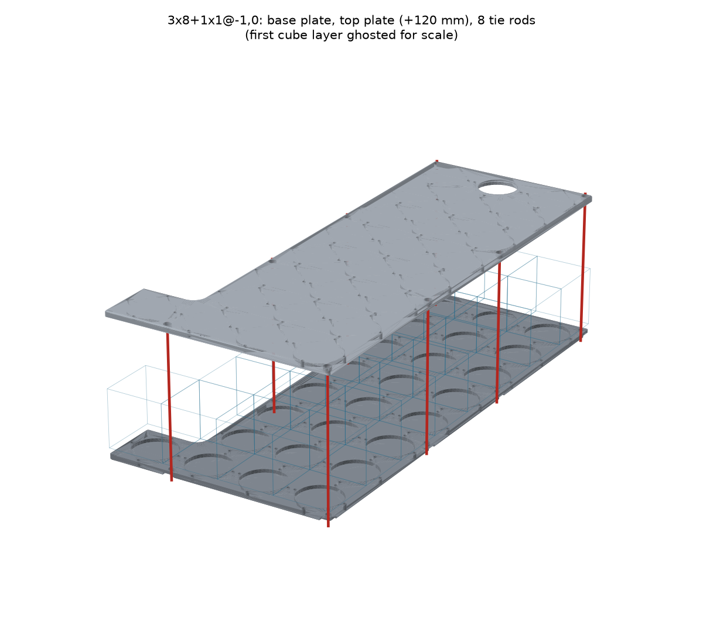
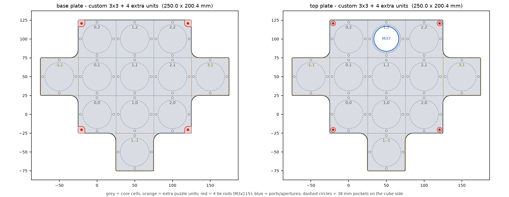
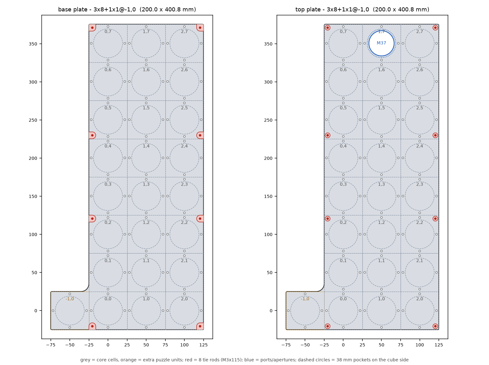

# openUC2 V4 optical-module (OPM) plates — top and base plate for any layout

*Parametric generator for the two 5 mm aluminium plates that sandwich an
optical module. Reverse-engineered over COM from the master
`MAS - 1003 - Base plates Al - V04` and the released pairs PRT-1051/1052
(3×8+1×1, the FLIM 488 module), PRT-1053/1054 (3×7+1×1), PRT-1026/1027 (3×6),
PRT-1047/1048 (3×3+1×2) and PRT-1045 (3×3); dumps and STEP ground truth in
[`extracted/plates/`](extracted/plates/).*

Source: [`uc2v4/opm_plates.py`](uc2v4/opm_plates.py). Editable layouts:
[`build_opm_plates.py`](build_opm_plates.py). Verified by
[`check_opm_plates.py`](check_opm_plates.py).



## 1. What an OPM is

An optical module is a block of 50 mm cubes clamped between a **base plate**
and a **top plate**. Every cube layer stands on a 5 mm **puzzle layer**
(PUZ11 pieces, one per cell, screwed to the plates' M3 holes), and M3 **tie
rods** run through the cube corners from the top plate to sleeve nuts under
the base plate:

```
 top plate      5 mm   ← ISO 4762 M3 heads in counterbores, optional port
 puzzle layer   5 mm
 cube layer 2  50 mm
 puzzle layer   5 mm
 cube layer 1  50 mm   (cube centres at z = 0)
 puzzle layer   5 mm
 base plate     5 mm   ← M3×8 sleeve nuts in recesses
```

One cube layer plus its puzzle layer is 55 mm, so for *L* layers the top plate
sits `55·L + 10` mm above the base plate (120 mm for the two-layer FLIM module)
and the tie rods are ISO 4762 **M3 × (55·L + 5)** — M3×115 for two layers,
exactly the hardware of `OPM - 0004 - FLIM 488`.

## 2. Describing a layout

Cells sit on a grid; cell `(c, r)` is column *c* (x) and row *r* (y), and cell
`(0, 0)` is the first cell of the **core rectangle**. Extra **puzzle units** can
hang off any side, including at negative indices.

| layout | meaning |
| --- | --- |
| `"3x3"` | 3 columns × 3 rows |
| `"3x8+1x1@-1,0"` | 3×8 core plus one extra unit left of cell (0,0) — PRT-1051/1052 |
| `"3x3@0,3+1x2@1,1"` | 3×3 core in rows 3–5 with a 1×2 leg under the middle column — PRT-1047/1048 |
| `"3x6-1x1@2,5"` | `-WxH@c,r` removes a block (here: a corner cell) |

`+WxH@c,r` adds a *W*×*H* block whose lower-left cell is `(c, r)`. Or draw it,
top line = far end, as seen from above:

```
.#P#.        #  core cube cell (carries the tie rods)
+###+        +  extra puzzle unit (no rods)
.###.        P  core cell with an M37 port in the top plate (p: extra cell)
..+..        .  empty
```



Layouts are validated: the cells must form **one piece** joined along edges —
two cells that touch only at a corner would pinch the plate to a point and are
refused, as are ports, apertures or rods placed on cells that are not there.
Enclosed holes (a ring of cells) are allowed.

**Pitch.** The master patterns columns at `Grid` = **50.0 mm** and rows at
`Grid + 0.1` = **50.1 mm**, and every current plate follows it (the older
PRT-1045 uses 50.0 both ways). It is a parameter, `pitch_mm=(50.0, 50.1)`.

## 3. What each plate carries

Both plates are modelled in the same frame as the Inventor parts — cell
(0, 0) centred on the origin, plate at z −35…−30 — and the top plate is
*translated*, not flipped, into place. So the cube side is z = −30 on the base
plate and z = −35 on the top plate.

| feature | value | source |
| --- | --- | --- |
| cell square | 50.0 × 50.1 mm, 5 mm thick; the outline is the union of the cells | MAS-1003 `Extrusion33`, `Rectangular Pattern1` |
| M3 holes | 4 per cell at (±22, 0), (0, ±22); M3×0.5-6H tapped through (modelled at the 2.46 minor Ø) | `Hole7` + `Circular Pattern9` |
| cell pocket | Ø38 × 3 mm on the cube side, every cell except a port cell | `Hole13/16` + `Rectangular Pattern4` |
| vertical edges | R1.5 at outside corners, R10.2 at inside corners (a Ø20 cutter) | `Fillet10`, `Fillet11/12` |
| outward face | 1 mm × 45° chamfer round the outline (and the base recesses) | `Chamfer16` |
| tie rods | at ±20.5 mm from a cell centre — the PUZ11 corner holes | `Hole10/13`, `Mirror3/4` |
| top plate, per rod | Ø3.4 through + Ø6.5 × 3.1 counterbore from the outer face | `Hole13`, `Extrusion15` |
| base plate, per rod | Ø4.5 through + R4.5 × 2.4 recess from below, run out as a **U-slot** to any plate edge it would otherwise graze (the rod is only 4.5 mm from a free edge); a corner rod gets a notch | `Hole10`, `Extrusion12/15` |
| M37 port (optional) | thread M37×0.5 from the cube side (2.73 deep at the 36.46 minor Ø), 45° step to a Ø37.4 × 1 relief, Ø33 aperture through a 0.8 mm lip — holds an optic with a M37×0.5 retaining ring | `Revolution1`, `Hole20` |

Also available: **plain apertures** (`Aperture(cell, d_mm, chamfer_mm)` — e.g.
the Ø35 + 1 mm chamfer port of PRT-1045/1047) and **custom holes**
(`CustomHole(d_mm, cell, offset_mm, depth_mm, face)`, through or blind from
either face).

## 4. Where the tie rods go

The rods clamp the stack, so they sit at the **outside corners of the core
cells**, plus intermediate rods along long edges so that **no more than three
cells** separate two rods. An intermediate rod goes into the cell on the side
of the nearer edge end; the exact middle of an even edge goes to the higher
row/column, so opposite edges stay mirror images. Extra puzzle units get no
rods. This one rule reproduces every released plate:

| part | layout | rods |
| --- | --- | --- |
| PRT-1045 | 3×3 | 4 corners |
| PRT-1026/1027 | 3×6 | corners + one pair at the middle (rows 2 \| 3) |
| PRT-1053/1054 | 3×7+1×1 | corners + pairs at rows 1 \| 2 and 4 \| 5 |
| PRT-1051/1052 | 3×8+1×1 | corners + pairs at rows 2 \| 3 and 4 \| 5 |
| PRT-1047/1048 | 3×3+1×2 | `tie_rods="outline"`: the leg's far corners too |

`tie_rods` is `"auto"` (core corners), `"outline"` (every outside corner of
the whole layout), `"none"`, or an explicit list such as
`(TieRod((0, 0), "sw"), TieRod((2, 0), "se"))`. Rods must pass through cubes
(or at least puzzle pieces) in every layer — the layout diagram shows them in
red, so check that against your module.



## 5. Using it

**Python** — define layouts in [`build_opm_plates.py`](build_opm_plates.py) and run
it, or directly:

```python
from uc2v4.opm_plates import OpmPlateSpec, PlateLayout, Port, generate

spec = OpmPlateSpec(layout=PlateLayout.parse("3x8+1x1@-1,0"),
                    layers=2, ports=(Port(cell=(1, 7)),))
plan = generate(spec, out_dir="generated/opm_plates/flim_488")
```

`generate` writes `*_top.step/.stl`, `*_base.step/.stl`, `*_stack.step` (both
plates in place), `*_plan.json` (cells and centres, tie rods, ports, pockets,
hardware list, mass) and `*_layout.png`. `plan_opm_plates(spec)` gives the plan
without building; `build_opm_plates(spec)` returns the two CadQuery solids.

**Command line**

```bash
uc2cad plates --layout 3x8+1x1@-1,0 --port 1,7
uc2cad plates --layout "3x3@0,3+1x2@1,1" --tie-rods outline --aperture 1,5:35:1
uc2cad plates --ascii-file my_module.txt --layers 1 --m3-hole 3.2
uc2cad plates --layout 4x4 --plan-only        # print the plan, build nothing
```

**Browser** — `uc2cad wizard`, tab *OPM plates*: click the cells on a grid
(core, extra unit, port), set the layers, and download a ZIP of all files with
a preview of the layout.

**optikit** — `build_parts(params)` returns `{"top": …, "base": …}` from
JSON-able parameters (`layout` as a spec string, ASCII or cell list, `layers`,
`ports`, `apertures`, `holes`, `tie_rods`, `pockets`, `pitch_mm`,
`m3_hole_d_mm`); `spec_from_dict` documents the keys. This is the surface the
OPM designer in optikit-v2 should call, in place of
`optikit-core/generators/plate_nxm.py`.

## 6. Verification

`check_opm_plates.py` (9 checks) asserts:

- the rod rule against all five released families (table above; worst 0.05 mm);
- for a plain 3×3, the released L, a 3×3 with extras on all four sides plus a
  port and an aperture, a ring with an enclosed hole, and a single one-layer
  cell: one valid solid per plate, extent = cells × pitch, 4 M3 holes per
  cell, a pocket per cell that takes a Ø37.8 disc, rods that pass straight
  through both plates with the M3 head and the sleeve nut seating, the port's
  aperture, lip and thread, apertures clear, and a chamfer on the outward face
  only;
- against the released STEPs (when `extracted/plates/` is present): the top
  plate matches **PRT-1052** in all 149 cylindrical features and has the same
  203 faces, volume −0.012 %, surface deviation p99 0.0005 mm / max 0.10 mm;
  the base plate (with PRT-1051's module-specific holes added as custom
  holes) matches **PRT-1051** in every feature but its 2.1 mm slots;
- the refusals (islands, corner contacts, unpositioned extra blocks, features
  on missing cells, zero layers, an oversize port).

```bash
uv run --with cadquery python check_opm_plates.py
uv run --with cadquery --with trimesh --with rtree --with scipy python check_opm_plates.py
```

## 7. Deliberate simplifications

- **Module-specific base-plate features are not generated.** PRT-1051, -1053
  and -1027 also carry four Ø10 × 2.4 pockets and a set of 2.1 mm-wide slots
  on the underside at a fixed distance from the far edge (and PRT-1051/1053
  two Ø4.2/Ø3.4 holes in row 1); PRT-1047/1048 have their own (Ø8.4 holes,
  Ø16.2 × 0.5 recesses, Ø20 pockets). Add what a module needs with
  `CustomHole`s.
- **Extra units use the grid pitch.** The released 3×8+1×1 places its extra
  cell at 50.1 mm in x (the grid says 50.0), i.e. 0.1 mm further out; within
  the drawing's ⌖0.1 tolerance, and the only deviation in the PRT-1052 match.
- Tapped holes are plain minor-diameter bores (threads are a drawing note:
  M3×0.5-6H, M37×0.5-5H). For printed plates use `m3_hole_d_mm=3.2`.
- Older variants' details (counterbore chamfers of PRT-1045/1047, the Ø35 port
  instead of the M37 thread) are available as options, not defaults.
