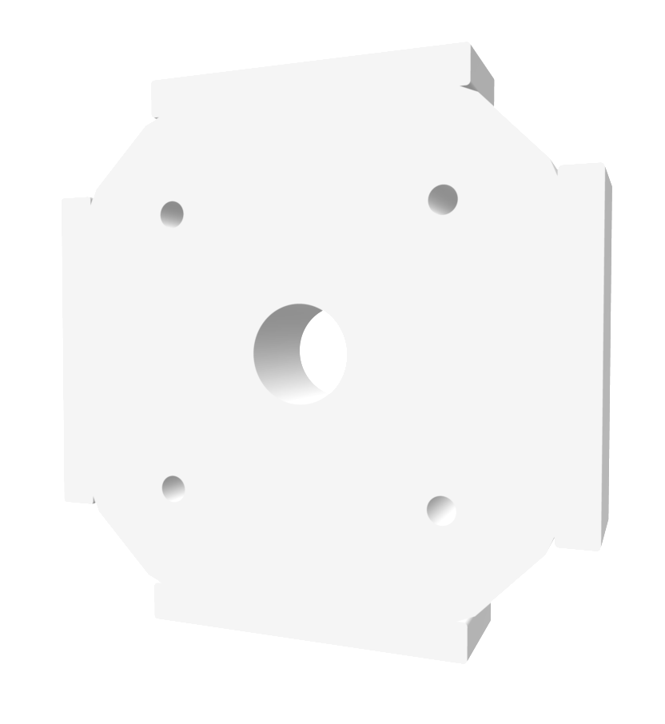

# openUC2 CadQuery Insert Generator (v4-style)

Programmatic generation of an **openUC2 cube insert** and **component cutouts** using **CadQuery**.

> **New: `uc2v4/` — exact parametric reconstructions of the molded V4 inserts.**
> Built from the Inventor master models (COM extraction, see
> [`extracted/README.md`](extracted/README.md)) and verified against the
> released STEP geometry:
>
> - `uc2v4.build_master_insert()` → PRT - 2123 - MASLCK - V04 - B
>   (4 mm master-insert plate: springs, corner ribs, 82° cone opening,
>   8×45° nose grooves, self-mating screw pattern)
> - `uc2v4.build_lens_insert()` → PRT - 2027 - INSLEND43F-50 - V04
>   (17 mm lens insert: parametric `lens_diam`, pocket/seat/aperture,
>   2-turn pitch-1.7 clamping thread for the pre-screw ring)
>
> ```bash
> uv run --with cadquery --with trimesh --with rtree --with scipy python build_uc2v4.py
> ```
> writes STEP/STL into `generated/` and prints the mesh-deviation report
> against `extracted/*.step`. Design write-up: [`DOCS-insert-v4-design.md`](DOCS-insert-v4-design.md).
> The same lens insert is available to optikit-core as the standalone T3
> generator `openuc2.tpl.square_insert_v4`.
>
> The scripts below predate the extraction and approximate the outline from
> drawings — still useful as simple starting points, but `uc2v4/` is the
> measured reference.



*Python-generated generic insert that can e.g. host a lens or something*

Goal:
- Create a reusable **insert “blank”** (outer geometry + optional tabs/wings + threaded holes).
- Create separate **component STEP cutters** (lens pockets, motor clearances, etc.).
- **Import any STEP cutter**, apply an **affine transform**, and **subtract** it from the insert to produce a printable/custom holder.

Coordinate system:
- **Optical axis = Z-axis**
- Optical axis passes through **(0, 0)** in the XY-plane
- All shapes are built around the origin by default


## Files

### 1) `uc2_component_cut_step.py`
Creates a **negative volume** (“cutter”) as a STEP file.

Typical use:
- Generate a lens pocket as a cylinder + optional seat + optional set-screw holes.
- Export as `component_cut.step` (and optionally `component_cut.stl`).

You can create multiple cutters, e.g.:
- `lens_25mm_cut.step`
- `motor_clearance_cut.step`
- `laser_mount_cut.step`

These STEP cutters are then consumed by the insert builder.

### 2) `uc2_insert_builder.py`
Creates the **insert body** and subtracts one or more imported STEP cutters.

What it generates:
- Outer insert outline (octagon-like profile from the technical drawing)
- Optional side tabs (or “wings” depending on the version you use)
- Optional center bore (or you do center bore via cutter STEP)
- Optional threaded/tapping holes
- Subtraction of imported cutters after applying affine transforms
- Exports `uc2_insert.step` and `uc2_insert.stl`


## Install

Create an environment and install CadQuery:

```bash
pip install cadquery
```

If your Python environment is already set up (e.g. `mambaforge`), install into that environment.

## Quick start

### Step 1: Create a cutter STEP (example lens pocket)

```bash
python uc2_component_cut_step.py
```

This writes:

* `component_cut.step`
* `component_cut.stl` (optional)

### Step 2: Build the insert and subtract the cutter

Edit `uc2_insert_builder.py` and add the cutter to `CUTTERS`, then run:

```bash
python uc2_insert_builder.py
```

This writes:

* `uc2_insert.step`
* `uc2_insert.stl`

## How cutters work

A cutter is any **solid STEP** you want to subtract from the insert.

Typical workflow:

1. Generate a cutter STEP in a dedicated script (preferred, reproducible)
2. Add it to `CUTTERS` list in `uc2_insert_builder.py`
3. Assign an affine transform for positioning/orientation
4. Boolean subtract (`insert.cut(cutter)`)

This supports:

* Lens holders (coaxial to optical axis)
* Motor pockets (offset + rotated)
* LED/laser holders
* Cable channels / clearance volumes
* Any imported CAD STEP solid

## Affine transforms

Each cutter can be positioned and rotated with:

* Translation: `tx, ty, tz` (mm)
* Rotation: `rx, ry, rz` (degrees, applied about origin, in order X → Y → Z)

Example: shift 2 mm in X, rotate 15° around optical axis:

```python
CUTTERS = [
    ("component_cut.step", Affine(tx=2.0, ty=0.0, tz=0.0, rx=0.0, ry=0.0, rz=15.0)),
]
```

Tip:

* If you want a lens centered on the optical axis, keep `(tx, ty) = (0, 0)`.

## Parameters you typically adjust

In `uc2_insert_builder.py`:

* `OUTER_HALF`, `SHOULDER_HALF` : insert outline
* `INSERT_THICKNESS`            : extrusion thickness
* `ADD_SIDE_TABS`, tab dimensions
* `ADD_THREAD_HOLES` and hole geometry
* `CUTTERS` list and each cutter transform

In `uc2_component_cut_step.py`:

* Lens diameter + clearance
* Seat diameter + depth
* Set screw count, diameter, radius

## License / contributions

This approach is meant to support openUC2’s open insert ecosystem:

* Generate inserts reproducibly
* Share scripts + parameters
* Allow others to remix and extend

If you create a useful cutter for a common component (lens size, motor, LED), publish it with:

* source script
* generated STEP
* a short usage snippet (recommended transform and parameters)

