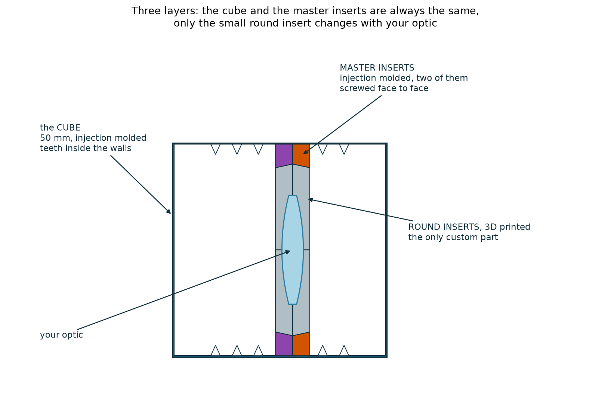
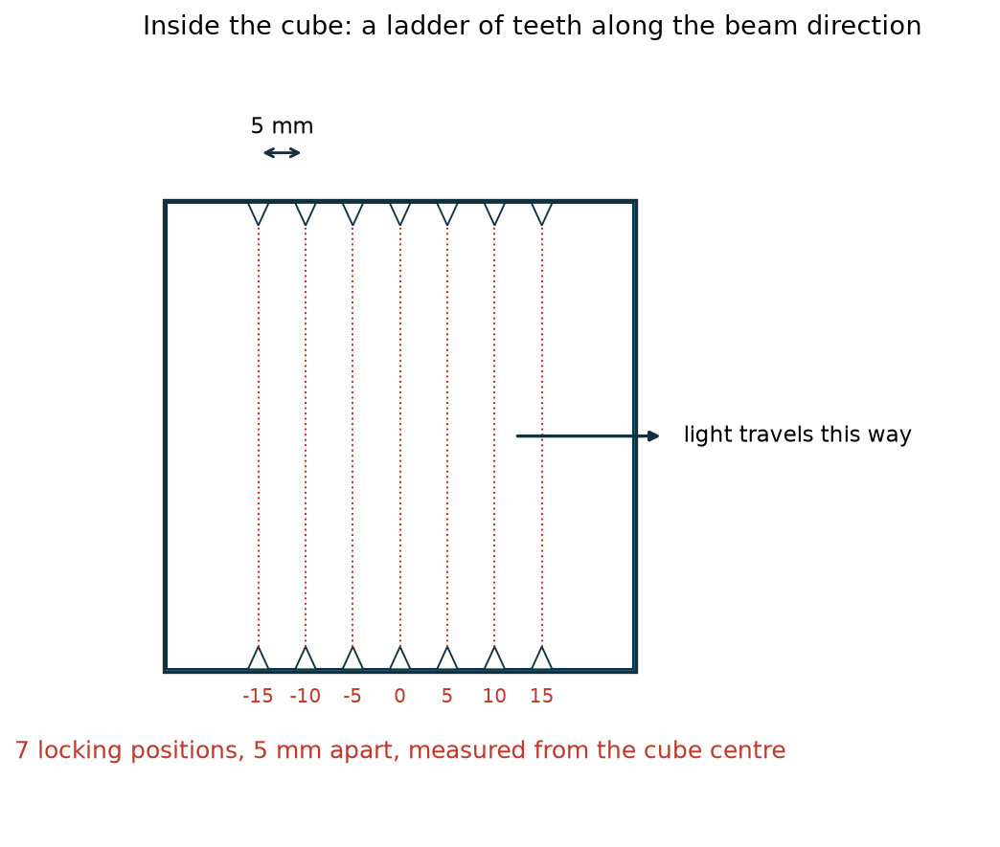
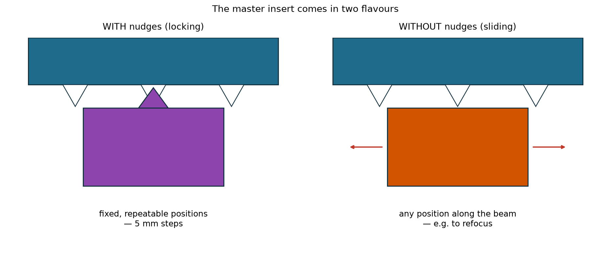
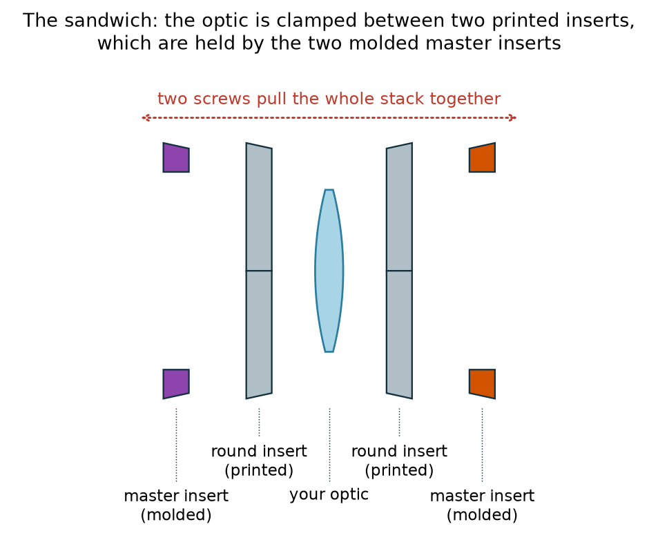
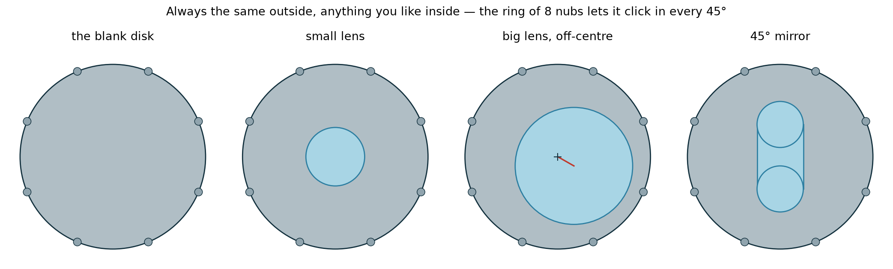
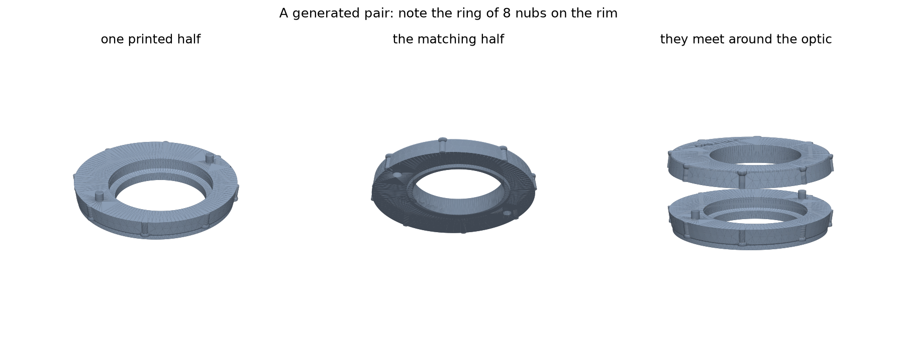
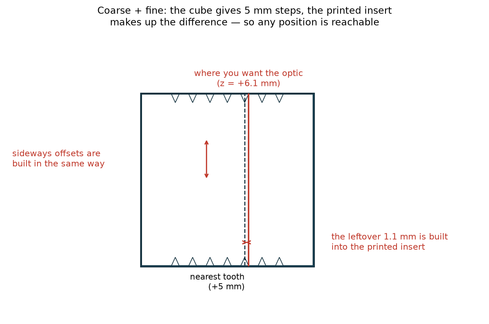
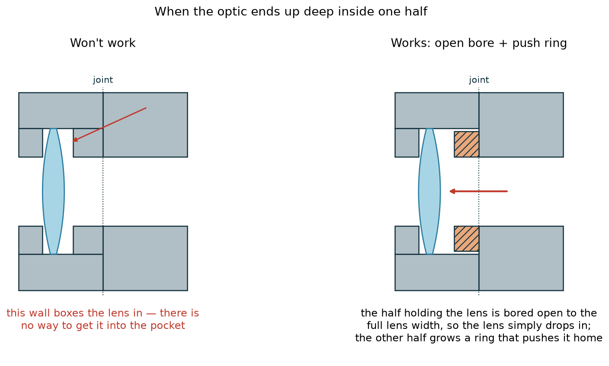

# Module inserts (V4)

Every optical component in openUC2 sits inside a 50 mm cube. This page
explains how it gets there: what the parts are, why there are two kinds of
master insert, and how you can put a lens (or a mirror, or a camera chip) at
*any* position inside the cube without designing a whole new mount.

No CAD knowledge is needed to read this. If you do want to generate your own
parts, there is a short section at the [end](#making-your-own-inserts).

## The idea in one picture



There are three layers, and they have very different jobs:

| Layer | Made how | Changes? |
| --- | --- | --- |
| **The cube** | Injection molded | Never — it is the same for everything |
| **The master inserts** | Injection molded | Never — two standard parts |
| **The round inserts** | 3D printed | **This is the only part that changes** |

That split is the whole point. Injection molding is precise and repeatable
but a mold is expensive, so we mold only the parts that are *always* the
same. 3D printing is cheap and instant but less precise, so it only ever
handles the small custom piece in the middle — the piece that actually grips
your optic. The precision that matters, the fit into the cube, is molded.

## The cube: a ladder of teeth



The cube is hollow, made from two identical molded halves. Along the inside
of two opposite walls runs a track with a row of **7 teeth, spaced exactly
5 mm apart**, sitting at −15, −10, −5, 0, +5, +10 and +15 mm measured from
the centre of the cube.

An insert slides into that track along the direction the light travels. The
teeth give it 7 defined stopping points. The *other* pair of walls has no
teeth at all — which is deliberate, and is what lets an insert be gripped in
one direction while still sliding in the other.

## The master insert: with or without nudges



The master insert is a flat molded ring, 4 mm thick, that slides into the
cube. It comes in two versions:

- **With nudges** — a small bump on its edge drops into one of the teeth.
  The insert now sits at a fixed, repeatable position, and it will sit at
  exactly that same position again if you take it out and put it back. Use
  this when the position matters.
- **Without nudges** — a smooth edge. The insert slides freely along the
  track and holds by friction, so you can put it anywhere and nudge it while
  you watch the image. Use this to focus something by hand.

Apart from that edge detail the two are identical. In the middle both have
the same **round Ø40 mm opening**, and around that opening are 8 small
grooves. Those grooves are what the round insert clicks into.

## The sandwich



Master inserts are used **in pairs**. Two of them are screwed face to face
with two small screws (TP 2.5 × 6 Torx), and the optic is trapped between
them — sandwiched between two round inserts.

A neat detail: the two master inserts are the *same part*, just flipped. The
screw holes are arranged so that a clearance hole on one always lines up with
a thread-forming hole on the other. One mold, no left-hand and right-hand
versions, and no way to assemble it wrongly.

Because they mate flipped, both of the round openings are **widest where the
two inserts meet** and taper towards the outside. So each round insert is
dropped in from the middle and is trapped once the sandwich is closed.

## The round insert: one shape, anything inside



This is the part that makes the system flexible. The round insert is a disk
of about Ø40 mm with a ring of **8 small nubs** around its rim. Those nubs
match the grooves in the master insert, so the disk clicks in and can be
turned in **45° steps** — useful when the thing you are holding is not
rotationally symmetric, like a rectangular mirror.

The outside of that disk is always identical. What is *inside* is entirely up
to you: a hole for a small lens, an off-centre pocket for a big one, a slot
for a 45° mirror, a seat for a camera board. Everything in the catalogue —
lens holders, mirror holders, laser holders — is this same disk with a
different middle.



## Placing an optic anywhere: coarse plus fine



Here is the trick that lets you reach *any* position, even though the teeth
only come every 5 mm.

The position splits into two parts:

1. **Coarse** — the cube's teeth put the sandwich at the nearest 5 mm step.
   This is molded, so it is precise and repeatable.
2. **Fine** — everything left over is simply *built into the printed insert*.
   If your lens should sit 1.1 mm past the nearest tooth, the pocket inside
   the printed part is machined 1.1 mm off-centre. The part does not move;
   the hole in it moves.

The same applies sideways. If your lens needs to sit 2 mm left and 1 mm down
from the optical axis, the pocket is simply cut 2 mm left and 1 mm down. A
tilt works the same way — the pocket is cut at an angle.

So: you specify a position, and the printed part absorbs the difference
between that position and the nearest tooth. Nothing has to be adjusted by
hand, and nothing can drift.

## Getting the optic in: seat and push ring



One practical wrinkle, because it is the kind of thing that only shows up
when you try to assemble the real thing.

If the optic happens to straddle the line where the two halves meet, there is
no problem: you lay it into one half and cap it with the other, like closing
a box.

But if it ends up sitting entirely *inside* one half, that half becomes a
closed pocket whose mouth is narrower than the lens — and the lens can never
be got in. The fix is:

- the half holding the optic is **bored open to the full lens diameter** all
  the way to the joint, so the lens simply drops in and comes to rest on a
  seat at the bottom;
- the other half grows a **push ring** that reaches across the joint and
  presses the lens onto that seat when the two are screwed together.

The ring only ever touches the outer edge of the optic, well outside the
clear aperture, so it never gets in the way of the light.

## Reference numbers

Handy if you are designing something that has to fit:

| | |
| --- | --- |
| Cube grid | 50 mm |
| Teeth inside the cube | 7, spaced 5.0 mm, from −15 to +15 mm |
| Insert outline | 49.4 mm square with cut corners |
| Master insert thickness | 4.0 mm (so a sandwich is 8 mm) |
| Round opening in the master insert | Ø40 mm, wall at 82° |
| Round insert | Ø ≈ 40 mm, 8 nubs, clicks every 45° |
| Sandwich screws | TP 2.5 × 6 Torx, 2 per sandwich |

## Making your own inserts

You do not need CAD to use the system — but if you want a holder for an optic
that is not in the catalogue, the round inserts can be generated
automatically from a handful of numbers.

The generator lives in
[openuc2-cadquery](https://github.com/openUC2/openuc2-cadquery) and is built
on [CadQuery](https://cadquery.readthedocs.io/) (Python). You describe the
lens and where you want it, measured from the centre of the cube:

```bash
python uc2v4/lens_cartridge.py \
  --diameter 25.4 --thickness 5 --r1 51.5 --r2 -51.5 \
  -x 2.0 -y -1.0 -z 5.3
```

and you get back:

- **two printable files** (STEP and STL) — the front and back round inserts,
  each already carrying the 8 nubs and an engraved label so you can tell them
  apart months later;
- a **summary** of what it decided: which tooth it snapped to, and how much
  offset the printed parts are absorbing;
- a **diagram** of the result, so you can check the plan before printing.

It works out the rest for you — how thick each half needs to be, whether the
optic needs the push ring described above, and whether what you asked for
actually fits. If it does not fit, it says so, rather than quietly producing
a part that cannot be assembled.

The same generator can produce the plain round blank, so it is also the
starting point for holding something that is not a lens at all.
